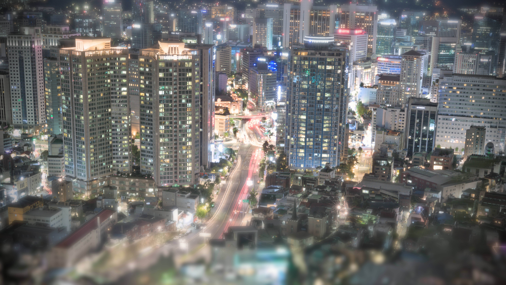

# Tilt Shift Effect with Parallel Computing

Shukai Ni, Jiayu Zheng

# Examples

## Manual

**Original Image**


**Tilt Shift Effect with GIMP**


## With CUDA

**TODO**

# Build

```shell
cd cuda
make -j`nproc`
# debug build
# debug=1 make -j`nproc`
```

# Usage

```
Usage: ./tiltshift <image_path> <kernel_dim> <sigma> <output_image>
Arguments:
  <input_path>    Path to the input image. Supported formats are PNG and JPEG.
  <kernel_radius> Dimension of the Gaussian kernel radius, center pixel included.
  <sigma>         Standard deviation of the Gaussian kernel. Must be a positive number.
  <output_path>  Path to the output image. Format is determined by the file extension.
```

# Global Workflow

1. Extract Near, Mid, Far region masks from the input image
2. Apply Gaussian blur to each mask
3. Blend the blurred masks together to get the final image

# Gaussian kernel

## Kernel generation

- $r$ is the radius of the kernel(including the center pixel)
- sigma is the standard deviation of the Gaussian function

We could use 1D Gaussian kernel to generate 2D Gaussian kernel:

$$ g(x) = \frac{1}{\sqrt{2\pi}\sigma}e^{-\frac{x^2}{2\sigma^2}} $$

The 2D Gaussian kernel is the outer product of two 1D Gaussian kernels.

After generating half of the 1D Gaussian kernel, we compute one eighth of the 2D Gaussian kernel. Then taking advantage of the symmetry, we can mirror the rest of the 2D Gaussian kernel.

In theory, we could mirror 1/8, then 1/4, then 1/2 of the entire kernel to take advantage of sequential memory access. However, to simplify the implementation and assuming a reasonably large kernel size, we will only mirror the entire kernel in parallel with OpenMP.

## Normalization

The overall brightness of an image should remain consistent after applying a Gaussian blur if the Gaussian kernel is normalized. A normalized Gaussian kernel has elements that sum up to 1. This ensures that when it's applied to an image, the total sum of pixel values in the filtered image remains approximately the same as in the original image.

However, due to the discrete nature of images and the approximation in the Gaussian blur, slight changes in brightness can still occur. This is because the Gaussian kernel is only an approximation of the Gaussian function, and the kernel is only applied to a finite number of pixels in the image.

Like before, we could use OpenMP to normalize the Gaussian kernel in parallel. In particular, we could use the reduction clause to compute the sum of all elements in the kernel.

## Normalization for advanced masks

In the goal state, user should be able to pass in a mask to specify the region of interest. In this case, the normalization should be done differently. Instead of normalizing the entire kernel, we should only normalize the kernel during the application. This way the kernel can be normalized based on the sum of brightness of the pixels in the region of interest.
K is the kernel matrix, M is the neighboring mask, N reprents neighboring pixels.

$$p_{ij} = \sum K_{ij} \cdot M_{ij} \cdot N_{ij}$$

For center pixel $p$ have similar brightness as the original image, we need to perform coefficient normalization:

$$K_{ij} = \frac{\sum K_{ij} \cdot M_{ij} \cdot N_{ij}}{\sum K_{ij} \cdot M_{ij}}$$

This solution avoids the problem of padding at the edge of the image because the edge will have one-sided pixels. It also adds support for arbitrary mask shapes and values.

# TODO

- [x] Manual effect with GIMP
- [x] Python effect
- [x] kernel generation with OpenMP
- [x] 2D Convolution in CUDA
- [x] Rectangle mask generation with OpenMP
- [x] Mask application in CUDA
- [x] Per mask Gaussian blur in CUDA
- [x] Mask blending in CUDA
- [x] Refactored CUDA functions
- [ ] Mask-based weighted blending, making sure the overlapping region is blended correctly

- [ ] Improve per pixel dot product in CUDA
- [ ] Create small vs large CUDA function for different kernel sizes
- [ ] Support 16-bit images

# References

- [stb_image](https://github.com/nothings/stb/) for image loading and saving
